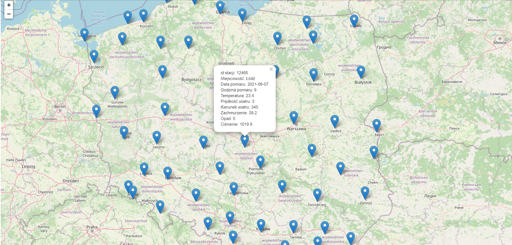

# Weather-map	
> Program for checking weather data (including temperature, rainfall, pressure) from each weather station in the Polish territory.
## Table of Contents
* [General Info](#general-information)
* [Technologies Used](#technologies-used)
* [Features](#features)
* [Screenshots](#screenshots)
* [Setup](#setup)
* [Project Status](#project-status)
* [Contact](#contact)

## General Information
Check the temperature, wind speed, wind direction, cloud cover, precipitation and pressure in Polish cities.

## Technologies Used
- Spring Boot
- OpenStreetMap
- Rest Api

## Features
Check the weather conditions on the map.

## Screenshots

## Setup
Clone the project to your own ide, run it and navigate to http: // localhost: 8080 /

## Project Status
Project is: complete 
// waiting for inspiration what else can be done here

## Contact

Created by [_qubiak_]( http://www.linkedin.com/in/bartłomiej-kubiak) - feel free to contact me!

